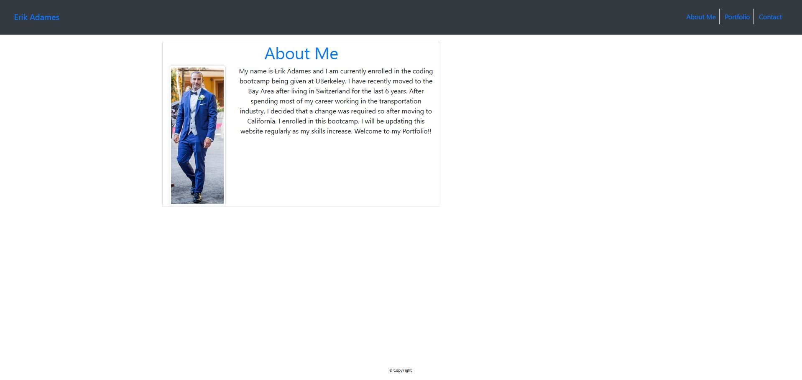
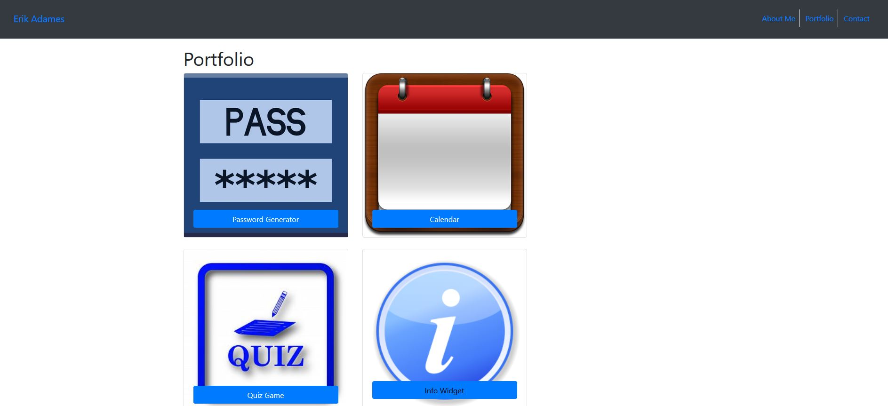
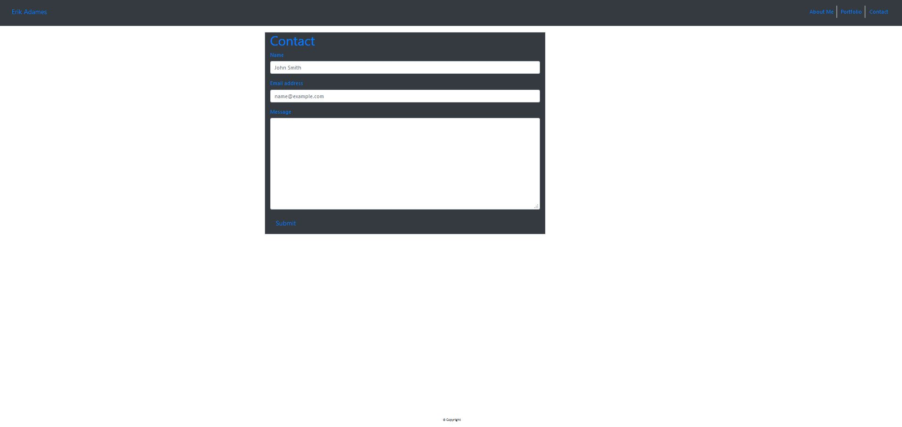

# Project Title

Updated Portfolio Website by Erik Adames

## Location of URLs

This is the link to the github repo:

https://github.com/egadames/updatedPortfolio

This is the link to the live website:

https://egadames.github.io/updatedPortfolio/index.html

### Description

- The app is a website that contain 3 links to 3 different sites. A contact me, portfolio and an About me page.

- the website contains a navbar that is responsive to various website sizes.

### Technologies

- The website uses HTML, CSS and the Bootstrap framework.

- The bootstrap framework was used to make the site responsive to different size screens

### Challenges

- This website was very difficult and made me realize that more training in CSS and bootstrap are required.

- The most difficult issue were trying to incorporate bootstraps features and CSS features like spacing and margin.

- By the end I was able to get a decent understanding of how to format with Bootstrap.

- My best method of learning was trial and error. I would copy the code directly from the bootstrap site and take out a one section at a time until i got an understanding of how to adjust.

### Screenshot

